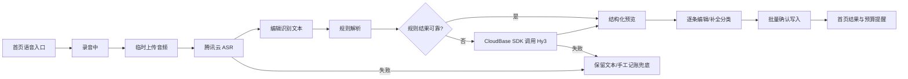

## Context

暖账是家庭协作记账微信小程序，现有记账记录写入 `records` 集合，金额以整数分保存，记录必须关联当前账本和当前收支类型下的分类。现有手工记账页已经支持类型、金额、分类、日期、备注和图片，并由 `record` 云函数完成最终权限和数据校验。

本变更新增“语音快速记账”流程，但不改变手工记账的主流程。语音流程涉及小程序录音、腾讯云 ASR、CloudBase AI、分类映射、批量记录写入和内容安全，必须将“识别”“解析”“确认写入”分成独立阶段。

当前已确认的外部资源约束：

- 腾讯云 ASR 使用一句话识别接口，测试已验证可返回中文识别结果。
- `cloud1` 是非资源点计费的 CloudBase 环境；成长计划下的 Hy3 不能通过直接 HTTP Base URL 调用免费额度，直接调用会返回 `AI_CHANNEL_NOT_ALLOWED`。
- 非资源点环境应通过 CloudBase 云函数 SDK 使用 `hunyuan-v3` provider 和 `hy3` 模型；不能把 CloudBase API Key 放进小程序或作为成长计划免费额度的直接 HTTP 凭证。
- 云函数调用 AI 需要 `wx-server-sdk` 3.0.5-beta.1 或更高版本；当前已有云函数仍使用 2.6.3，新增 AI 云函数必须单独声明满足要求的版本。

## Goals / Non-Goals

**Goals:**

- 让用户通过一次短语音完成一笔或多笔日常收支的初步录入。
- 让用户在任何记录写入前看到并修改识别文本和结构化结果。
- 用本地确定性规则覆盖简单高频表达，用 Hy3 处理中文数字、口语化日期、复杂备注和多笔表达。
- 复用现有账本、分类、记录权限和预算提醒规则，不产生绕过现有校验的写入口。
- 在网络、权限、额度、模型或解析失败时保留用户输入，并平稳回退到手工记账。
- 默认不持久化原始音频，不在日志中记录密钥、完整语音内容或完整 AI Prompt。

**Non-Goals:**

- 不做持续实时字幕、多人说话人分离、长录音转写或语音播报。
- 不允许 AI 自动创建分类、修改账本、修改预算或直接提交记录。
- MVP 不自动推断 AA 分摊、借贷关系、转账关系、退款冲销或复杂数学分摊；遇到这些表达时阻止自动入账，并引导用户改为普通收支后明确确认或转手工处理。
- 不替换现有手工记账页，不把语音入口放入 TabBar。
- 不保存原始音频作为记录附件；用户如需凭证仍使用现有图片上传。

## Decisions

### 1. 采用“录音 → ASR → 文本确认 → 结构化解析 → 结果确认 → 写入”分阶段流程

流程状态如下：



采用分阶段而不是“录音后直接入账”，原因是 ASR 可能听错金额，AI 可能误判类型或分类，且家庭账本写入不可逆。每个阶段都必须能取消、重试或返回上一阶段。

### 2. 录音采用点击开始/点击停止，首版最长 30 秒

使用 `wx.getRecorderManager()`。用户点击开始后按钮进入录音状态，再次点击停止；达到 30 秒自动停止并进入识别。30 秒可覆盖一句话多笔记账（如"今天午饭30，晚上收到工资5000"）和慢速说话者，仍在腾讯云一句话识别接口支持范围内，同时限制上传大小、ASR 消耗和等待时间。

录音前检查麦克风权限；拒绝权限时展示系统设置引导。录音为空、音量过低或无语音时不调用 AI，提示用户重新录音或改用手工记账。

### 3. ASR 由服务端调用，原始音频只做临时中转

小程序先将录音上传到 CloudBase 云存储得到临时 `fileID`，调用 `voice-entry` 云函数的 `recognize` action。云函数通过 `cloud.downloadFile({ fileID })` 下载音频用于 ASR 调用，使用服务端 SecretId/SecretKey 签名调用腾讯云 `SentenceRecognition`，得到文本后在 `finally` 等价路径中通过 `cloud.deleteFile({ fileList: [fileID] })` 删除云存储中的临时文件。ASR 密钥只存在云函数环境变量或 CloudBase 密钥配置中。系统不保存原始音频；最终记录最多保存 `source`、`voiceRequestId`、`voiceItemId` 等最小来源元数据，不保存音频 URL，也不默认保存完整 transcript。

客户端不直接调用腾讯云 ASR，原因是 SecretKey 不能进入小程序包；服务端还可以统一限制时长、文件大小、频率和错误重试。

### 4. 解析采用规则优先、Hy3 兜底

规则解析适合金额、明显的收支词、相对日期和现有分类名称，成本低、延迟稳定、可测试。Hy3 只处理规则无法可靠覆盖的表达，避免每次简单记账都消耗 Token。

规则阶段至少覆盖：

- 阿拉伯数字金额：`30`、`30.5`、`30元`、`30块5`、`1,299.90`。
- 中文数字金额：`三十元`、`一百二十八块`。
- 收支词：`花了/买了/支付/支出` → expense，`收到/工资/奖金/报销到账` → income。
- 日期词：`今天/昨天/前天/上周日/本月1号`，统一转换为 `YYYY-MM-DD`。
- 分类：优先匹配当前账本、当前 type 下的分类名称和别名；只返回真实 `categoryId`，不能让模型凭空生成 ID。
- 多笔分隔：按“，”“、”“然后”“另外”“还有”等明确连接词拆分；无法确认边界时作为一条待编辑文本处理。

Hy3 Prompt 必须要求只返回固定 JSON，不返回 Markdown，不返回自然语言解释。云函数对返回 JSON 做二次校验，校验失败不得写入记录。

### 5. 当前非资源点环境默认使用 `hunyuan-v3` provider

AI provider 作为云函数配置常量而不是小程序配置：

- 当前 `cloud1`：`ai.createModel('hunyuan-v3')`，模型名 `hy3`。
- 未来环境升级为资源点套餐并启用模型开关后，才允许切换到 `cloudbase` provider。

不得在实现中使用保存的 CloudBase Base URL/API Key 直连成长计划免费额度。这样既不符合当前环境限制，也会让免费额度扣除和计费来源不可控。

### 6. 解析结果使用候选项，不直接复用 records 文档

解析返回的临时结构建议为：

```json
{
  "requestId": "client-generated-id",
  "transcript": "今天午饭花了三十元，晚上收到工资五千元",
  "items": [
    {
      "itemId": "item-1",
      "type": "expense",
      "amountFen": 3000,
      "categoryId": "real-category-id",
      "categoryName": "午餐",
      "date": "2026-08-01",
      "remark": "午饭",
      "confidence": 0.96,
      "needsReview": false,
      "source": "rule"
    }
  ],
  "warnings": []
}
```

`categoryName`、`confidence`、`source` 和 `warnings` 用于展示和诊断，最终写入仍只使用经过用户确认且通过后端校验的字段。未知分类的 `categoryId` 必须为 null，并将该条目标记为 `needsReview`，确认按钮不可用直到用户选择分类。

### 7. 批量写入采用预校验 + 幂等 + 逐条写入 + 失败补偿删除

前端为每次确认生成 `requestId`，每条记录有稳定的 `itemId`。后端 `record` 云函数增加 `batchCreate` action，采用**预校验 + 幂等标记 + 逐条写入 + 失败补偿删除**的一致性策略，不依赖数据库事务。原因是当前 CloudBase 数据库事务能力未验证、现有 `record` 云函数 `add` 也不依赖事务，靠前置校验保证写入合法性。统一策略可保证两条写入路径（手工单条、语音批量）语义一致。

具体流程：

1. **幂等检查**：先按 `requestId` 查询是否已处理，命中则直接返回首次结果，不重复写入。
2. **全量预校验**：账本成员身份、账本可写状态、记录数量上限、每条 item 的金额（正整数分）、日期、类型、分类归属、内容安全（复用现有 `assertRecordContentSafe`）。任一项不通过则**整批拒绝**，不写入任何记录。
3. **逐条写入**：预校验通过后按顺序 `add` 每条记录，记录 `voiceRequestId`、`voiceItemId`、`source: 'voice'` 等可选元数据。
4. **失败补偿**：若第 N 条写入抛出异常，对前 N-1 条已成功写入的记录执行补偿删除；补偿删除本身失败时记录孤儿记录日志，由人工或定时任务兜底。
5. **返回结果**：整批成功返回 `{ success: true, recordIds: [...], budgetAlerts: [...] }`；整批失败返回 `{ success: false, error, failedItems }`；补偿未完成返回明确待确认状态，绝不向用户报告"全部成功"。

同一个 `requestId` 重复提交必须返回第一次提交结果或明确的重复请求结果，不得产生重复记录。`source: 'voice'`、`voiceRequestId`、`voiceItemId` 均为可选字段，不影响现有记录展示和统计。

### 8. 预览编辑复用现有记账字段和分类选择器

预览页不新增一套分类体系。每条候选记录使用现有 `category-picker`，分类列表按该条记录的 `type` 加载；切换 expense/income 时清空不匹配分类。金额输入仍以元展示、以分提交；日期使用现有日期选择器；备注可编辑。

全部候选项有效时显示“确认记账”；存在未完成分类、无效金额或日期时只显示“继续编辑”。用户可以删除不想入账的候选项，但删除全部后不得调用批量写入。

### 9. 错误处理以保留输入为优先

ASR、Hy3 或网络失败时，当前页面必须保留录音流程产生的文本或错误上下文，提供“重试识别”“重新录音”“手工记账”三个去向。错误提示使用用户可理解的文案，不暴露 API 错误码、Prompt、SecretId 或内部 URL；详细错误只记录脱敏日志。

### 10. 费用、频率和日志控制

- 单次录音最长 30 秒，单个用户连续识别请求需节流，默认 10 秒内不允许重复发起相同阶段请求。
- 同一 `requestId` 只能成功写入一次；解析请求必须有超时和最大重试次数，禁止无限重试。
- 记录 requestId、stage、耗时、结果数量、错误类别和模型 provider；不记录原始音频、完整 transcript、完整 Prompt、API Key 或返回原文。
- AI 资源包用量通过 CloudBase 控制台观察；测试不得使用直接 HTTP Base URL 作为成长计划免费额度验证方式。

## Risks / Trade-offs

- [ASR 识别错误] → 必须展示可编辑 transcript，并在金额、类型、分类缺失时阻止确认。
- [Hy3 返回非 JSON 或幻觉分类] → 服务端 JSON Schema 校验；分类只允许映射当前账本真实分类 ID。
- [多笔写入部分成功] → 优先数据库事务；无法事务时使用幂等标记和补偿机制，并返回逐条结果。
- [录音上传后残留云存储] → 临时文件使用 requestId 命名，在成功、失败、超时和异常路径统一删除；定时清理作为兜底。
- [成长计划调用渠道不合规] → AI 只从云函数 SDK 调用；不把 Base URL/API Key 放前端，不在 Trae/Codex 直接消耗成长计划资源。
- [SDK 版本不支持 AI] → 新增 AI 云函数锁定 `wx-server-sdk >= 3.0.5-beta.1`，部署前在云函数包内验证 `cloud.ai` 存在。
- [用户误以为识别成功就是已入账] → 页面状态明确区分“识别完成”“解析完成”和“已确认入账”；只有后端批量写入成功才显示成功反馈。
- [用户一句话内容过于复杂] → MVP 对 AA、转账、退款、借贷和隐含分摊标记为需要人工处理，不强行猜测。

## Migration Plan

1. 在测试环境创建并部署 `voice-entry` 云函数，配置 ASR SecretId/SecretKey 和 AI provider，不写入仓库文件。
2. 在测试账本验证录音、ASR、规则解析、Hy3 兜底、预览编辑和批量写入。
3. 为 `record` 云函数增加批量写入和幂等校验，保持现有 `add/list/get/update/delete` action 兼容。
4. 前端先隐藏入口或仅对测试账号开放，完成真机麦克风、弱网和权限测试后再开放正式环境。
5. 发布时先部署云函数，再发布小程序；若 AI 服务异常，前端保留手工记账入口，关闭语音入口即可回滚，不影响既有记录。
6. 不需要迁移历史 records；新增 voice 元数据字段全部可选。

## Confirmed Product Decisions

- 入口采用现有首页新增记账按钮（浮动“+”）的动作面板，面板内提供“手工记账”和“语音记账”两个选项；不额外增加独立麦克风按钮，也不新增 Tab。
- MVP 支持一句话中明确列举的多笔记录，但不支持 AA、转账、借贷、退款冲销和复杂分摊的自动记账。
- 识别文本和解析草稿只在本次流程内保留，不做跨页面持久化；用户主动确认后，正式记录只保存正常账本字段。
- 不保存原始录音、音频 URL 或默认完整 transcript；如确有追踪需要，只保存 `source: 'voice'`、`voiceRequestId`、`voiceItemId` 等最小来源元数据。
- 批量确认采用预校验 + 幂等 + 逐条写入 + 失败补偿删除的一致性策略，不依赖数据库事务；详见 Decision 7。

## Implementation Decisions Pending Verification

- ASR 的 SecretId/SecretKey 最终采用云函数环境变量、CloudBase 密钥管理还是腾讯云 CAM 子账号权限，需要在部署前确定最小权限方案。
- 需要在测试环境验证批量事务、重复请求和补偿回滚的实际行为。
